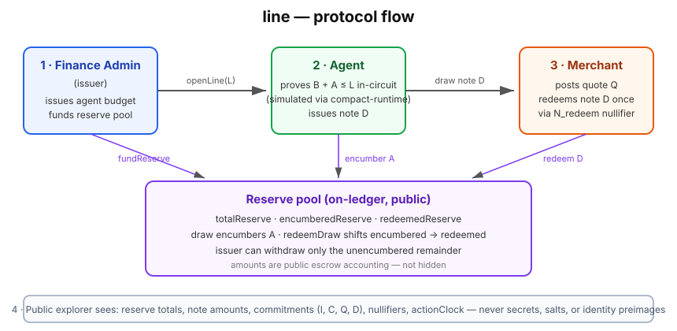

# Line

**Private spending guardrails for autonomous agent fleets.**

An enterprise finance admin issues a budget to an agent and funds a verifiable settlement reserve pool — corporate cards for AI agents, Midnight-private. An agent proves in the ZK circuit (simulated locally via compact-runtime) that an invoice fits remaining budget capacity and that sufficient unencumbered reserve exists. A merchant receives a cryptographically-bound draw note redeemable once against the admin's reserve pool. A finance-admin-confirmed repayment restores budget capacity privately.

Wave 2 of the [Midnight Buildathon](https://app.akindo.io/wave-hacks/jaMZjqPOBsLXvjdG).

---

## Business Model

- **Who pays:** agent-platform operators and enterprise fleet admins — the people who already issue API keys, compute budgets, and corporate cards to fleets of AI agents today.
- **How:** a protocol fee on `draw` / `redeemDraw` accruing to a fee reserve against the float (Wave 3 accounting; Wave 2 ships the reserve mechanics it attaches to). Issuers monetize the private spend they backstop instead of eating 100% of the default risk for free.
- **Distribution wedge:** the MCP server. Agents already reach for tools over JSON-RPC — `line` ships as budget-guardrail tooling inside the agent's own toolchain, not as a dashboard an admin has to learn.
- **Moat:** the privacy story x402 and delegated-card rails can't tell. x402 moves money with no privacy and no budget semantics; Visa-delegated spend is observable by the network. Line's budgets, counterparty-graph masking, and strategy privacy are the differentiation — not the payments themselves.

## Why not x402 / prefunded wallets

x402 (Coinbase / Linux Foundation) moves money with no privacy and no credit/budget semantics — every payment is a naked transfer. Prefunded agent wallets trap liquidity and are theft targets: one leaked key drains the whole balance. Line is the private budget-guardrail layer underneath: the enterprise issues capped budgets, the agent spends inside them proving `B + A + F ≤ L` without exposing strategy, and the merchant settles against an escrowed reserve it can verify on-ledger.



**Reading the diagram:** (1) the finance admin (issuer) issues the budget `openLine(expiry)` with the limit as a private witness and funds the reserve; (2) the agent draws against a merchant's quote, proving capacity in-circuit and issuing note `D`; (3) the merchant redeems `D` once via the `N_redeem` nullifier; (4) the public explorer sees anonymous escrow flows — amounts are visible as unattributable flows; attribution is what the ZK hides.

## Honest Wave 2 Boundary & Reality Check

- **Exact Settlement-Accounting Prototype**: Wave 2 implements the exact Compact settlement accounting model: on-chain reserve pools, encumbered reserve tracking, private merchant-bound draw notes ($D$), single-redemption nullifiers ($N_{\text{redeem}}$), and unencumbered reserve withdrawal protections.
- **Local Simulator Execution**: The Compact contract (`contracts/line.compact`) is written in Compact 0.26, compiled with Compact toolchain 0.34.0, and executed against `@midnight-ntwrk/compact-runtime` 0.19.0.
- **Not Deployed to Preprod**: There are no live on-chain contract addresses, Night/Dust token payouts, or live testnet transactions. Claiming a live Preprod address would be misleading.
- **Compilation Mode**: Local and CI verification uses `compact compile --skip-zk` to ensure instant builds and zero drift without distributing hundreds of megabytes of `.bincode` proving keys.

---

## What is Real vs Simulated

| Layer | Implementation Reality |
|---|---|
| **Compact Contract** (`contracts/line.compact`) | **Real Compact 0.26 source code** containing all 12 circuits, compiling cleanly with toolchain **0.34.0**. |
| **Generated Bindings** (`contracts/managed/line`) | **Real compiler output** (`--skip-zk`), checked into git and verified against compiler drift. |
| **Compact Simulator Tests** | **Real Compact execution** via `@midnight-ntwrk/compact-runtime` **0.19.0** running 60 circuit-level unit and attack tests. |
| **TypeScript Engine** (`protocol.ts`) | Strict replica of Compact encodings (`persistentHash`, `persistentCommit`); cross-implementation hash/commitment vectors verified against real compiler output, simulator-executed. |
| **Web Desks** (`/issuer`, `/merchant`, `/agent`, `/explorer`, `/lab`) | Interactive simulator UI for interacting with the 4 protocol roles and testing attack vectors. |
| **MCP Server** (`mcp/line-mcp.mjs`) | Standard JSON-RPC Model Context Protocol tools for autonomous AI agents. |
| **On-Chain Token Transfers** | Simulated on-chain reserve accounting. Asset bridge to Cardano/Midnight tokens is Wave 3. |

---

## Privacy Map

Rewritten against the actual circuit signatures and ledger structs (Oct 2026 rework): credit limit $L$, outstanding balance $B$, epoch, per-quote invoice amounts, and the merchant↔quote↔note linkage are **hidden in ZK witnesses**. What the ledger discloses by design: reserve totals and their deltas, settled note amounts, commitments, nullifiers, the registered-merchant allowlist, `actionClock`, and fee amounts.

The frame: **amounts are visible as anonymous flows; attribution is what the ZK hides.** A single draw's size is visible as an `encumberedReserve` delta and a `NoteMeta.amount` entry — but nothing on-ledger says whose budget it came from, which merchant it settles with, or how much of the limit remains.

| Data Item | Public / Disclosed | Private / Confidential |
|---|---|---|
| **Credit limit ($L$), outstanding ($B$), epoch** | ❌ Never in public inputs or ledger state | ✅ ZK witnesses, bound to line commitment $C$ by the stale check |
| **Per-quote invoice amounts** | ❌ Not in `QuoteMeta`; sealed opaquely inside the $Q$ preimage | ✅ Hidden until settlement |
| **Settled note amounts** | ✅ `NoteMeta.amount` on ledger + `encumberedReserve`/`redeemedReserve` deltas — anonymous flows | ❌ Unattributable: no link to agent, merchant, or limit |
| **Merchant↔quote↔note linkage** | ❌ `QuoteMeta` stores no `merchantPk`; quotes map holds opaque commitments only | ✅ Unlinkable — the agent proves registered-merchant membership in ZK |
| **Registered-merchant allowlist** | ✅ The SET is public (`registeredMerchants`) | ✅ Which member quoted a given quote is not |
| **Reserve totals & fee** | ✅ `totalReserve`, `encumberedReserve`, `redeemedReserve`, `feeReserve` — publicly auditable | ❌ Which note or draw a delta belongs to |
| **Agent identity** | ✅ `identityCommit` ($I$) on ledger | ✅ Secret preimage never revealed |
| **Commitments ($C$, $Q$, $D$) & nullifiers** | ✅ Disclosed on ledger | ✅ Openings, salts, and nonces never revealed |
| **Transition timing** | ✅ Disclosed via `actionClock` | ✅ Reasoning behind failures is hidden |

Failed draws always surface the generic error:
> **`Clearance could not be proven.`**

No observer can deduce whether a rejection was caused by budget capacity, reserve insolvency, merchant mismatch, default status, or bad signature.

---

## The 12 Compact Circuits

| Circuit | Role / Caller | Purpose & Invariant |
|---|---|---|
| `registerMerchant` | Issuer | Registers merchant public key in `registeredMerchants: Map<Bytes<32>, Boolean>`. |
| `disableMerchant` | Issuer | Deactivates a merchant; blocks new quotes, existing quotes stay live. |
| `fundReserve` | Issuer | Deposits liquidity into `totalReserve`. |
| `withdrawUnencumberedReserve` | Issuer | Withdraws unencumbered liquidity (`totalReserve - (encumbered + redeemed + feeReserve)`). |
| `withdrawFees` | Issuer | Pays out the accrued issuer fee reserve. |
| `openLine` | Issuer | Initializes credit line commitment $C_0$ with $B=0$, status `OPEN`. |
| `postQuote` | Merchant | Commits to opaque invoice $Q$ bound to `lineGeneration` and `contractDomain`. |
| `draw` | Agent | Proves $B+A+F \le L$ with witness-private books ($L$, $B$, epoch), reserve solvency, issues private note $D$, encumbers reserve, accrues the issuer fee. |
| `redeemDraw` | Merchant | Merchant opens $D$ with secret, spends $N_{\text{redeem}}$, moves encumbered to redeemed reserve. |
| `cancelOrExpireNote` | Issuer / Anyone | Releases encumbered reserve back to unencumbered if note expired unredeemed. |
| `acknowledgeRepayment` | Issuer | Proves receipt bound to current $C$, restores agent capacity privately, spends $N_{\text{repay}}$. |
| `setStatus` | Issuer | Toggles `OPEN`, `DEFAULTED`, `CLOSED`. |

---

## Cryptographic Commitments & Domain Separation

### Contract Domain
Every contract instance binds its state to an immutable contract domain generated from the constructor's `instanceNonce`:
$$\text{contractDomain} = \text{persistentHash}([\text{pad}(32, \text{"line:v2:domain"}), \text{issuerPk}, \text{initialMerchantPk}, \text{instanceNonce}])$$

### Draw Note Commitment ($D$)
When an agent draws, a merchant-bound private note is issued:
$$D = \text{persistentCommit}\langle\text{DrawNotePreimage}\rangle(\{ \text{domain}, \text{lineGen}, I, Q, \text{merchantPk}, A, \text{nonce}, \text{expiry} \}, \text{noteSalt})$$
- The on-chain `notes` map stores `{ A, redeemed, cancelled, expiry, lineGen }` — the settled amount **is** public escrow accounting, an anonymous flow.
- **Merchant linkage is private by construction (audit H3), merchant secrets are not.** The `quotes` ledger map stores no `merchantPk` — it holds opaque commitments only. In `draw`, the agent supplies the quote's merchant as a private witness and proves in ZK that (1) the witness preimage recomputes to the public $Q$, and (2) the witness `merchantPk` is on the public `registeredMerchants` allowlist. The allowlist SET is public; which member quoted is not. At redemption, the caller opens the note preimage and proves $sk \to \text{merchantPk}$ matches, without revealing the secret.
- To redeem, the merchant must prove knowledge of $sk$ deriving $\text{merchantPk}$ matching the preimage opening.

### Redemption Nullifier ($N_{\text{redeem}}$)
$$N_{\text{redeem}} = \text{persistentHash}([\text{pad}(32, \text{"line:v2:redeem"}), sk_{\text{merchant}}, D, \text{contractDomain}])$$
Recorded in `nullifiers: Set<Bytes<32>>` to prevent double-redemption.

---

## 19-Step Scripted Demo Walkthrough

The demo executes a complete, non-trivial multi-merchant credit and settlement lifecycle:

0. **Genesis**: Empty ledger.
1. **Register Merchant B**: Issuer registers second merchant.
2. **Fund Reserve (500)**: Issuer deposits 500 liquidity into reserve pool.
3. **openLine 150**: Budget line opened for agent ($L=150$ as a private witness — the explorer sees only $C_0$, limit absent).
4. **Merchant A: postQuote 40**: Merchant A posts opaque invoice $Q_{40}$.
5. **Agent: draw 40 -> Note D1**: Agent draws; note $D_1$ issued; 40 reserve encumbered.
6. **Attack: Merchant B tries to redeem D1**: Rejected: note opening invalid.
7. **Merchant A: redeem D1 (40)**: Merchant A redeems note; 40 moves from encumbered to redeemed.
8. **Attack: Merchant A tries to redeem D1 again**: Rejected: double-redemption blocked.
9. **Merchant B: postQuote 120**: Merchant B posts opaque quote $Q_{120}$.
10. **Over-limit failure**: Agent draw 120 rejected ($40 + 120 > 150$).
11. **Issuer: acknowledgeRepayment 40**: Issuer ack restores capacity ($B=0$).
12. **Merchant B: post fresh quote 120**: Fresh quote $Q_{120b}$ posted.
13. **Agent: draw 120 -> Note D2**: Agent draws 120; note $D_2$ issued; 120 reserve encumbered.
14. **Attack: Issuer tries to withdraw encumbered reserve**: Rejected: locked funds protected.
15. **Merchant B: redeem D2 (120)**: Merchant B claims 120 from reserve.
16. **Issuer: setStatus(DEFAULTED)**: Issuer marks line defaulted.
17. **Post-default draw fails**: Rejected: draws blocked while defaulted.
18. **Public Explorer Review**: Auditable proof that settled amounts match public escrow accounting — and that no private books ($L$, $B$, quote amounts), counterparty bindings, salts, or identity preimages were ever published.

---

## Model Checking & Test Coverage

Line maintains a comprehensive, reproducible test suite:
- **92 automated tests** passing with zero failures.
- **Cross-language commitment vectors**: Verifies that the TypeScript replica produces identical hashes and commitments to the Compact contract's real compiler output (simulator-executed, not deployed bytecode).
- **Compact Simulator tests**: 60 contract-level tests covering all 12 circuits, attack vectors, and negative privacy tests.
- **Deterministic state machine model checker**: 50 pseudo-random operations validating all 10 invariants across edge cases.
- **MCP server tests**: Validates all 8 tools and rejection handling over JSON-RPC.

---

## Quick Start

### Installation
```bash
git clone https://github.com/ShrikarT/line.git
cd line
npm install
```

### Verification & Testing
```bash
# Compile Compact contract (skip-zk for local simulation)
npm run compact:compile

# Run full test suite (145 tests)
npm test

# Run Compact simulator tests only
npm run compact:test

# Run MCP server tests
npm run mcp:test

# Typecheck and build frontend
npm run typecheck
npm run build
```

### Running Interactive Web Desks
```bash
npm run dev
```
Open `http://localhost:5173` to explore the interactive desks:
- `/` — Interactive 19-step narrative
- `/issuer` — Finance-admin budget issuance and reserve management
- `/merchant` — Multi-merchant quote posting and note redemption
- `/agent` — Agent private console
- `/explorer` — Public explorer
- `/lab` — Security attack lab
- `/circuits` — Specification of all 12 Compact circuits

### Running Local MCP Server
```bash
npm run mcp
```

---

## Judge Quick Path

Zero-install evaluation in four commands (Node ≥ 22 required):

```bash
npm ci                        # install dependencies
npm run compact:compile       # compile contracts/line.compact → contracts/managed/line (drift gate)
npm test                      # full suite
npm run dev                   # interactive desks on http://localhost:5173
```

**Expected outputs:**
- `npm run compact:compile` — compiles cleanly with toolchain 0.34.0; a subsequent `git status` shows no changes under `contracts/managed/` (CI enforces this as a drift gate).
- `npm test` — **145 tests, 32 suites, 145 pass, 0 fail** (protocol 56, demo 14, encoding 4, compact 60 incl. attack vectors + negative privacy tests, model 1×50 ops, MCP 10).
- `npm run typecheck` — clean, no errors.
- `npm run dev` — desks at `/`, `/issuer`, `/merchant`, `/agent`, `/explorer`, `/lab`, `/circuits`.

---

## Documentation Index

- [docs/WAVE2_PLAN.md](docs/WAVE2_PLAN.md) — Technical design and architecture specification
- [docs/WAVE2_SECURITY_REVIEW.md](docs/WAVE2_SECURITY_REVIEW.md) — Itemized threat model, invariants, and test matrix
- [docs/WAVE2_DEMO.md](docs/WAVE2_DEMO.md) — Detailed narrative of the 19-step lifecycle flow
- [docs/WAVE2_DEPLOYMENT.md](docs/WAVE2_DEPLOYMENT.md) — Proving key policy and deployment requirements
- [docs/ENCODING.md](docs/ENCODING.md) — Compact encoding specification
- [docs/WAVE2_PROGRESS.md](docs/WAVE2_PROGRESS.md) — Execution tracking checklist

---

## License

Apache License 2.0. See [LICENSE](LICENSE).
