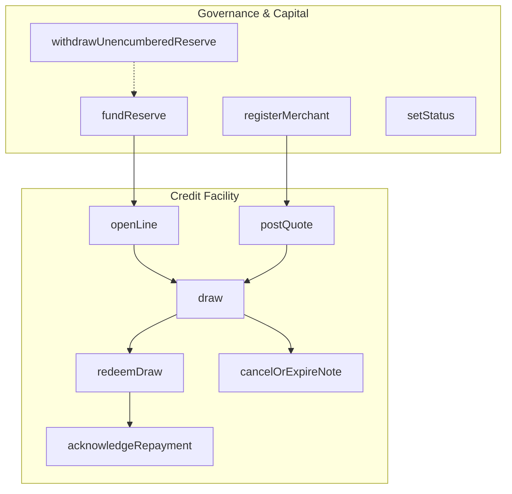

# Product Architecture & Technical Specification

## Line: Private Credit and Checkout Infrastructure for Autonomous Agents

### Overview

Line provides institutional-grade, zero-knowledge revolving credit and checkout infrastructure for autonomous AI agents. In multi-agent commerce, agents require delegated purchasing capacity without exposing their treasury balance, credit limits, or outstanding obligations to merchants or public observers.

With Line:
1. An **Issuer** establishes an on-chain credit line and allocates reserve capacity.
2. A **Merchant** issues an opaque quote commitment for an invoice.
3. An **Autonomous Agent** proves client-side in zero-knowledge that the invoice fits within its unrevealed available limit ($B + A \le L$).
4. A successful draw transitions the confidential credit commitment ($C \to C'$), encumbers settlement reserve, and issues a merchant-bound, non-replayable claim note ($D$).
5. The merchant redeems the claim note against the reserve.
6. Issuer-acknowledged repayments restore the agent's available credit line privately.

---

## The 10 Compact Circuits

The protocol is formally specified in `contracts/line.compact` across exactly ten circuits:



### 1. `registerMerchant(merchantPk: Bytes<32>)`
- **Caller:** Issuer
- **Purpose:** Whitelists merchant public keys in `registeredMerchants` map.
- **Security:** Ensures only verified merchant pseudonyms can post quotes and receive claim notes.

### 2. `fundReserve(amount: Uint<64>)`
- **Caller:** Issuer
- **Purpose:** Allocates settlement reserve capacity backing agent draw notes.
- **Accounting:** `totalReserve = totalReserve + amount`.

### 3. `withdrawUnencumberedReserve(amount: Uint<64>)`
- **Caller:** Issuer
- **Purpose:** Permits withdrawal of idle reserve capital.
- **Invariants:** `amount <= totalReserve - (encumberedReserve + redeemedReserve)`. Prevents issuer from rug-pulling capital encumbered by active draw notes.

### 4. `openLine(limit: Uint<64>, expiry: Uint<64>)`
- **Caller:** Issuer
- **Purpose:** Establishes the agent's revolving line.
- **Witnesses:** Agent secret $k$, initial commitment salt $s_0$.
- **Commitment:** $C_0 = \text{persistentCommit}(\{ \text{domain}, I, L, 0, 0 \}, s_0)$ where $I = \text{agentId}(k)$.
- **Privacy:** Credit limit $L$ and balance $B=0$ are committed in witness; neither is stored in plaintext on-chain.

### 5. `postQuote(amount: Uint<64>, expiry: Uint<64>)`
- **Caller:** Registered Merchant
- **Purpose:** Commits to purchase price and terms.
- **Witnesses:** Merchant secret $sk_M$, invoice ID $\text{invId}$, nonce.
- **Commitment:** $Q = \text{persistentHash}([\text{"line:quote"}, \text{merchantPk}, A, \text{invId}, \text{expiry}, \text{nonce}, \text{gen}, \text{domain}])$.

### 6. `draw(quoteCommitPublic, limit, outstanding, epoch, amount, quoteExpiry)`
- **Caller:** Agent
- **Verification:**
  - Authenticates agent identity: $\text{agentId}(k) == I$.
  - Opens current commitment $C$: $\text{persistentCommit}(\{ \text{domain}, I, L, B, e \}, s) == C$.
  - Enforces capacity constraint in ZK: $B + A \le L$.
  - Reconstructs quote $Q$ to verify merchant price and expiration.
  - Enforces reserve backing: $\text{withdrawableReserve} \ge A$.
- **State Mutation:**
  - Spends nullifier $N_{\text{draw}} = \text{persistentHash}([\text{"line:draw"}, k, Q, \text{domain}])$.
  - Rotates commitment to $C' = \text{persistentCommit}(\{ \text{domain}, I, L, B + A, e + 1 \}, s_{\text{new}})$.
  - Increases `encumberedReserve = encumberedReserve + A`.
  - Creates draw note $D = \text{persistentCommit}(\text{DrawNotePreimage}, \text{noteSalt})$.

### 7. `redeemDraw(noteCommit, amount, expiry)`
- **Caller:** Merchant
- **Verification:**
  - Proves knowledge of note opening and merchant ownership in ZK: $\text{merchantPk} == \text{publicKey}(sk_M)$.
  - Enforces note has not expired: $\text{actionClock} \le \text{expiry}$.
- **State Mutation:**
  - Inserts redemption nullifier $N_{\text{redeem}} = \text{persistentHash}([\text{"line:redeem"}, sk_M, D, \text{domain}])$.
  - Moves encumbered capital: `encumberedReserve -= amount`, `redeemedReserve += amount`.
  - Marks note redeemed in `notes[D].redeemed = true`.

### 8. `cancelOrExpireNote(noteCommit, amount)`
- **Caller:** Any authorized party
- **Purpose:** Releases encumbered reserve when a draw note expires without redemption ($\text{actionClock} > \text{expiry}$).
- **State Mutation:** Marks `notes[D].cancelled = true` and decrements `encumberedReserve -= amount`.

### 9. `acknowledgeRepayment(limit, outstanding, epoch, amount, receiptExpiry)`
- **Caller:** Issuer
- **Purpose:** Reconciles off-chain payment and restores available revolving capacity.
- **Verification:** Opens current commitment $C$ and spends repayment nullifier $N_{\text{repay}}$.
- **State Mutation:** Rotates $C \to C'$ with $B' = B - A$ and $e' = e + 1$.

### 10. `setStatus(next: Status)`
- **Caller:** Issuer
- **Purpose:** Administrative lifecycle controls (`OPEN`, `DEFAULTED`, `CLOSED`). Defaulting freezes draw circuits immediately.

---

## Contract Domain Isolation

To prevent cross-instance replays across different deployments, the contract constructor generates a unique domain identifier:
$$\text{contractDomain} = \text{persistentHash}([\text{"line:domain"}, \text{issuerPk}, \text{initialMerchantPk}, \text{instanceNonce}])$$

Every commitment ($C, Q, D$) and nullifier ($N_{\text{draw}}, N_{\text{redeem}}, N_{\text{repay}}$) cryptographically includes `contractDomain`.
Preimages from instance A cannot be used to execute transitions on instance B.

---

## Reserve Accounting Equations

The reserve pool maintains strict mathematical solvency across all circuits:

$$\text{withdrawableReserve} = \text{totalReserve} - (\text{encumberedReserve} + \text{redeemedReserve})$$

- **Solvency Invariant:** $\text{encumberedReserve} + \text{redeemedReserve} \le \text{totalReserve}$
- **Anti-Rug Protection:** $\Delta \text{withdraw} \le \text{withdrawableReserve}$
- **Draw Backing:** A draw note of amount $A$ is permitted if and only if $\text{withdrawableReserve} \ge A$.

---

## Runtime Architecture

```text
LineRuntime (Interface)
├── MidnightNetworkRuntime   (Production Midnight indexer + wallet integration)
├── LocalDevelopmentRuntime (Local Compact simulator + development adapter)
└── InMemoryTestRuntime      (Isolated in-memory execution for unit tests)
```

1. **Production Path:** `MidnightNetworkRuntime` connects to Midnight network RPC/indexer and browser wallet. Fails explicitly if network credentials or contract address are missing.
2. **Development Path:** `LocalDevelopmentRuntime` runs the compiler-generated contract bindings against a local environment.
3. **Automated Testing:** `InMemoryTestRuntime` executes test vectors with zero external dependencies.
