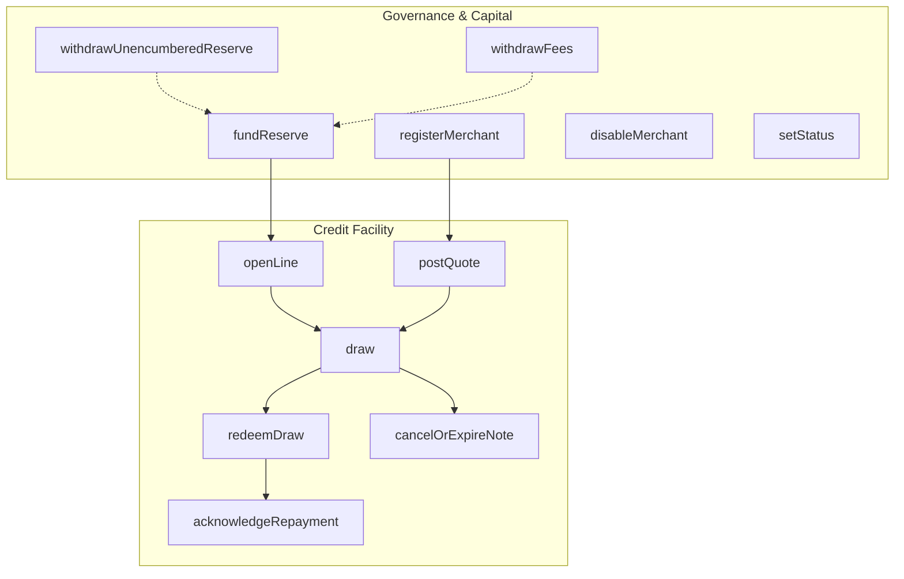

# Product Architecture & Technical Specification

## Line: Protocol prototype for agent purchasing; private credit is the unproven destination

### Overview

Line is a protocol prototype testing whether organizations need issuer-authorized purchasing and supplier reconciliation for agents. Its destination is private revolving credit and complete checkout, subject to the privacy, independent key custody, and cash-settlement gates in [PRODUCT_DIRECTION.md](PRODUCT_DIRECTION.md). No customer demand, supplier acceptance, or full product operation is established.

Current execution establishes local generated-Compact credit constraints, merchant-bound claims, and deterministic demo service results. Public note amounts, reserve deltas, registered merchant keys, and history reveal purchase activity. The reserve counter is not asset custody; claim redemption does not prove service or payment; an issuer-authenticated line opening currently takes the agent secret as a witness; and API scopes in the shared server are not independent role custody.

Target architecture, subject to the unresolved privacy and role-custody gates in [PRODUCT_DIRECTION.md](PRODUCT_DIRECTION.md):
1. A named organization accepts borrower liability, and an identified issuer/capital provider supplies the agreed liquidity.
2. A merchant authenticates a quote, then verifies a finalized, one-time claim before following agreed fulfillment and payout terms.
3. The agent proves the issuer-approved credit predicate without transferring its signing secret to the issuer. This boundary is not implemented: current `openLine` requires `agentSecret()` as a witness during an issuer-authenticated call.
4. A successful draw updates committed credit state and creates a merchant-bound claim. Current public state reveals note amounts, reserve deltas, registered merchant keys, and transaction history; it does not provide full purchase privacy.
5. The merchant fulfills under its own durable idempotency policy and receives payment under a written settlement SLA. A circuit claim proves neither service quality nor payout.
6. Authenticated repayment and actual reserve-inflow receipts restore debt capacity and usable cash. The current accounting treats these as separate operations and does not verify the assets.
---

## The 12 Compact Circuits

The protocol is formally specified in `contracts/line.compact` across exactly 12 circuits:


```mermaid
flowchart TD
    subgraph Governance & Capital
        FR[fundReserve]
        WR[withdrawUnencumberedReserve]
        WF[withdrawFees]
        RM[registerMerchant]
        DM[disableMerchant]
        SS[setStatus]
    end

    subgraph Credit Facility
        OL[openLine]
        PQ[postQuote]
        DR[draw]
        RD[redeemDraw]
        CN[cancelOrExpireNote]
        AR[acknowledgeRepayment]
    end

    FR --> OL
    RM --> PQ
    OL --> DR
    PQ --> DR
    DR --> RD
    DR --> CN
    RD --> AR
    WR -.-> FR
    WF -.-> FR
```

### 1. `registerMerchant(merchantPk: Bytes<32>)`
- **Caller:** Issuer
- **Purpose:** Whitelists merchant public keys in `registeredMerchants` map.
- **Security:** Ensures only verified merchant pseudonyms can post quotes and receive claim notes.

### 2. `disableMerchant(merchantPk: Bytes<32>)`
- **Caller:** Issuer
- **Purpose:** Disables a registered merchant: blocks new quotes from being posted while preserving membership so existing quotes remain drawable.

### 3. `fundReserve(amount: Uint<64>)`
- **Caller:** Issuer
- **Purpose:** Allocates settlement reserve capacity backing agent draw notes.
- **Accounting:** `totalReserve = totalReserve + amount`.

### 4. `withdrawUnencumberedReserve(amount: Uint<64>)`
- **Caller:** Issuer
- **Purpose:** Permits withdrawal of idle reserve capital.
- **Invariants:** `amount <= totalReserve - (encumberedReserve + redeemedReserve + feeReserve + pendingFeeReserve + refundReserve + reportedRefundReserve)`. Prevents issuer from rug-pulling capital encumbered by active draw notes or accrued fees.

### 5. `withdrawFees()`
- **Caller:** Issuer
- **Purpose:** Releases accrued draw fees from `feeReserve` back to the issuer.
- **Accounting:** Decrements `totalReserve` and `feeReserve` by the accrued fee amount.

### 6. `openLine(expiry: Uint<64>, flatFee: Uint<64>, basisPoints: Uint<64>)`
- **Caller:** Issuer
- **Purpose:** Establishes the agent's revolving line.
- **Pricing:** Sets public `feeFlat` and `feeBps` (0–10000) for this generation. Changing terms requires a zero-debt close and fresh opening; default/resume preserves pricing.
- **Witnesses:** Agent secret $k$, initial commitment salt $s_0$, and credit limit $L$ (via witness `lineLimit()`).
- **Commitment:** $C_0 = \text{persistentCommit}(\{ contractDomain, I, L, 0, 0 \}, s_0)$ where $I = \text{agentId}(k)$. The generated line opening includes the instance domain; identical openings in different domains produce different commitments.
- **Privacy:** Credit limit $L$ and balance $B=0$ are committed in witness; neither is stored in plaintext on-chain.

### 7. `postQuote(expiry: Uint<64>)`
- **Caller:** Registered Merchant
- **Purpose:** Commits to purchase price and terms.
- **Witnesses:** Merchant secret $sk_M$, invoice ID $\text{invId}$, nonce, and quote amount $A$ (via witness `quoteAmount()`).
- **Commitment:** Uses the exact `line:v3:quote` tag and ten-element field order in [PROTOCOL.md](PROTOCOL.md): merchant key, invoice ID, encoded amount/expiry, nonce, encoded generation, domain, encoded flat fee and basis points.

### 8. `draw(quoteCommitPublic: Bytes<32>, noteExpiry: Uint<64>, fee: Uint<64>)`
- **Caller:** Agent
- **Verification:**
  - Authenticates agent identity: $\text{agentId}(k) == I$.
  - Opens current commitment $C$ using private witness books: $\text{persistentCommit}(\{\text{contractDomain}, I, L, B, e\}, s) == C$.
  - Enforces capacity constraint in ZK: $B + A + \text{fee} \le L$.
  - Proves `fee = feeFlat + ceil(A * feeBps / 10000)`; both underpayment and overcharging reject. Charging debt does not prove collection or earned revenue.
  - Reconstructs quote $Q$ from private quote witnesses (amount, nonce, merchantPk, invoiceId) plus public quote metadata to verify merchant price and terms.
  - Enforces reserve backing: $\text{withdrawableReserve} \ge A + \text{fee}$.
- **State Mutation:**
  - Spends nullifier $N_{\text{draw}} = \text{persistentHash}([\text{"line:v2:draw"}, k, Q, \text{domain}])$.
  - Rotates commitment to $C' = \text{persistentCommit}(\{\text{contractDomain}, I, L, B + A + \text{fee}, e + 1 \}, s_{\text{new}})$.
  - Increases `encumberedReserve += A` and `pendingFeeReserve += fee`.
  - Creates draw note $D = \text{persistentCommit}(\text{DrawNotePreimage}, \text{noteSalt})$.

### 9. `redeemDraw(noteCommitPublic: Bytes<32>, noteExpiry: Uint<64>)`
- **Caller:** Merchant
- **Verification:**
  - Proves knowledge of note opening and merchant ownership in ZK: $\text{merchantPk} == \text{publicKey}(sk_M)$.
  - Enforces `blockTimeLt(noteExpiry)` for the authenticated absolute Unix-seconds deadline; unrelated administrative activity cannot expire the claim.
- **State Mutation:**
  - Inserts redemption nullifier $N_{\text{redeem}} = \text{persistentHash}([\text{"line:v2:redeem"}, sk_M, D, \text{domain}])$.
  - Moves encumbered capital: `encumberedReserve -= amount`, `redeemedReserve += amount`; the note's pending fee moves to earned feeReserve.
  - Marks note redeemed in `notes[D].redeemed = true`.

### 10. `cancelOrExpireNote(D: Bytes<32>, action: Uint<8>, receiptExpiry: Uint<64>)`
- **Action 0 / anyone:** Ledger-time expiry moves principal and pending fee into a full-cost refund budget, leaving private debt unchanged.
- **Action 1 / issuer or original agent:** Proves the original fee-bound note, credits the authentic current book once, and privately commits cash owed. Historical claims do not touch a new generation's book. Zero owed releases the full budget; positive owed retains it all.
- **Action 2 / issuer:** Proves the exact positive private refund opening and consumes an unused canonical payment reference. Full cost moves into reportedRefundReserve without reducing totalReserve or freeing backing. This reports, but does not verify, a cash refund.
- **Recovery:** Prewrites the resulting private book/refund records; unique compensation markers must match alongside C. Refund-report recovery also verifies the exact consumed reference. [Protocol and limits](PROTOCOL.md).

### 11. `acknowledgeRepayment(receiptExpiry: Uint<64>)`
- **Caller:** Issuer
- **Purpose:** Reconciles off-chain payment and restores available revolving capacity.
- **Verification:** Opens current commitment $C$ via private witness books and spends repayment nullifier $N_{\text{repay}}$.
- **State Mutation:** Rotates $C \to C'$ with $B' = B - A$ and $e' = e + 1$.

### 12. `setStatus(next: Status)`
- **Caller:** Issuer
- **Purpose:** Administrative lifecycle controls (`OPEN`, `DEFAULTED`, `CLOSED`). Defaulting freezes draw circuits immediately.

---

## Contract Domain Isolation

To prevent cross-instance replays across different deployments, the contract constructor generates a unique domain identifier:
$$\text{contractDomain} = \text{persistentHash}([\text{"line:v2:domain"}, \text{issuerPk}, \text{initialMerchantPk}, \text{instanceNonce}])$$

Quotes, notes, nullifiers and the line-state commitment include `contractDomain`. Cross-instance tests reuse identical private openings/salts and require different line roots. This does not hide public history or establish complete book confidentiality. The detailed repayment receipt includes mutable C, but a separate issuer/domain-bound stable payment nullifier prevents exact-reference reuse across repayment and refund reports; authentic cash and global allocations remain open.

---

## Reserve Accounting Equations

The reserve pool maintains strict mathematical solvency across all circuits:

$$\text{withdrawableReserve} = \text{totalReserve} - (\text{encumberedReserve} + \text{redeemedReserve} + \text{feeReserve} + \text{pendingFeeReserve} + \text{refundReserve} + \text{reportedRefundReserve})$$

- **Solvency Invariant:** $\text{encumberedReserve} + \text{redeemedReserve} + \text{feeReserve} + \text{pendingFeeReserve} + \text{refundReserve} + \text{reportedRefundReserve} \le \text{totalReserve}$
- **Anti-Rug Protection:** $\Delta \text{withdraw} \le \text{withdrawableReserve}$
- **Draw Backing:** Amount plus fee must fit this reserve and private credit capacity. Reserve checks alone do not authorize a draw. Funding/redemption/withdrawal are accounting transitions, not asset transfers.

---

## Runtime Architecture

```text
LineRuntime (Interface)
├── MidnightNetworkRuntime   (Network adapter under validation)
├── LocalDevelopmentRuntime (TypeScript protocol model for existing consoles)
└── InMemoryTestRuntime      (Isolated testing)

CheckoutEvaluation          (Separate generated Compact local execution)
└── Vite dev/preview HTTP middleware → /checkout policy-agent experience
```

1. **Network Path:** The intended adapter connects to RPC/indexer and browser wallet; compatible packages, compiled-contract setup, wallet adaptation and confirmed lifecycle remain acceptance dependencies. No live deployment is established here.
2. **Existing Development Path:** `LocalDevelopmentRuntime` uses the TypeScript protocol model. Passing that model is distinct from running generated circuits.
3. **Automated Testing:** `InMemoryTestRuntime` executes test vectors with zero external dependencies.

## Executable purchase evaluation

`server/checkout-engine.ts` calls the generated contract through `compact-harness.ts`, with fresh role keys and `instanceNonce`. `server/checkout-http.ts` exposes separate issuer and agent bearer capabilities. Issuer endpoints configure/read the private book and acknowledge evaluation repayments. Agent endpoints buy catalog services, and cannot call issuer operations. Merchant A/B use distinct secrets for their own quotes and claims; note openings passed to merchant execution exclude the credit book and agent key.

Merchant A computes document analysis; Merchant B computes payload size and a disclosed processing heuristic. The fixed policy agent purchases both. Receipts bind request ID, service, quote, note and stages. It preserves fulfilled results when retrying a declined purchase. Exact live-session retries reuse their intent, and a stage journal resumes an interrupted redemption instead of creating another draw. HTTP capacity is bounded before initialization; new purchases close after 30 minutes, while expired sessions with unresolved obligations retain evidence and continue to count against capacity. Browser loss can strand those local capabilities until operator recovery is implemented.

This is centralized evaluation: the Node process holds all secrets, and the browser evaluator has both issuer and agent capabilities. Service fulfillment is local deterministic computation, not independent suppliers. Default storage is volatile; configured encrypted checkpoints recover generated state, role capabilities and purchase stages after server restart. Browser capability loss remains unresolved. No submitted proofs, cash collection or payout exist in this route. Vite supplies its server middleware; static hosting requires an actual API deployment. [Checkout durability](CHECKOUT_DURABILITY_2026-10-10.md) and [console journaling](OPERATION_RECOVERY_2026-10-10.md) document the distinct authorities and remaining requirements.

The target remains independent stores/custody, authenticated interoperable quotes/receipts, genuine suppliers, supported network finality, real backing/payout, durable recovery, compensation, full-history privacy, enforceable risk/fee policy, fleet operation and external adoption evidence. The evaluation is measurable progress toward those requirements, not completion of them.
